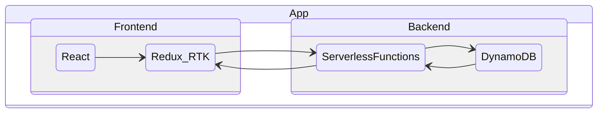

# Pong-Ping Project

### Prerequisites

- `NodeJS v16.15` or greater
- Serverless v3
  ```
  npm install -g serverless@3
  ```
- Yarn (preferably latest version) `npm i -g yarn`
- Java Runtime Engine (JRE) `6.x` or greater (used by `serverless-dynamodb-local`)

### Running project locally

1. Install dependencies

   ```
    yarn install
   ```

2. install the dynamodb-local instance
   ```
   cd backend && serverless dynamodb install
   ```
3. Configure the `.env` variable under `ui/.env` and `backend/.env`
   (optional, by default is already pointed to the local serverless instance)
   * `ui/.env`
   ```
   REACT_APP_BACKEND_ENDPOINT="YOUR_SERVERLESS_API_ENDPOINT"
   ```
   * `backend/.env`
   ```
   API_ENDPOINT="YOUR_SERVERLESS_API_ENDPOINT"
   ``` 
4. Go back to the repo directory (`cd ..`) and run the project
   - For Unix & Unix-like systems
   ```
   yarn dev
   ```
   - Windows -
     Open two terminal tabs and run the following commands on each session (in order to run in parallel):
   ```
       yarn ui
   ```
   ```
       yarn backend
   ```

### Running tests

- Frontend:
  ```
     yarn test:ui
  ```
- Backend (requires that the backend is running/deployed):
  ```
     yarn test:backend
  ```
### App State Diagram

